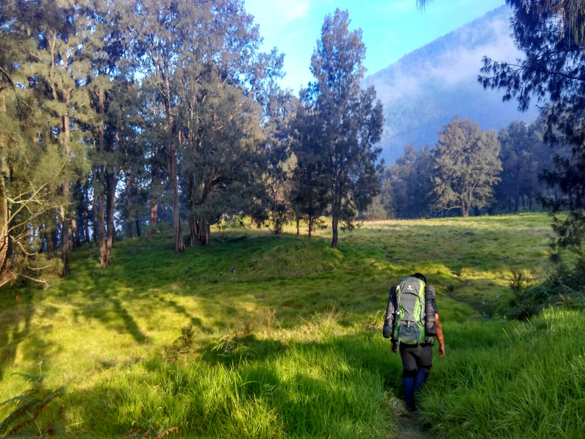
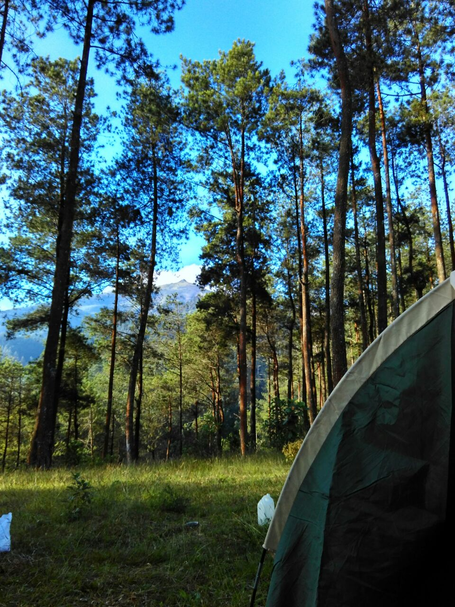
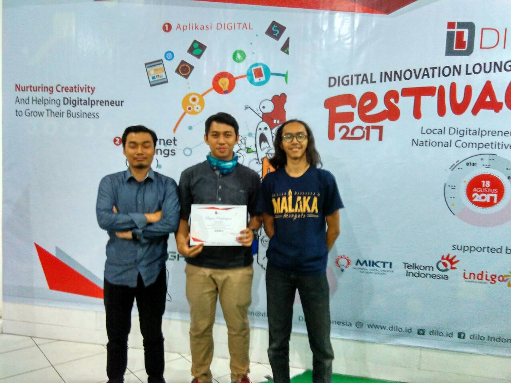
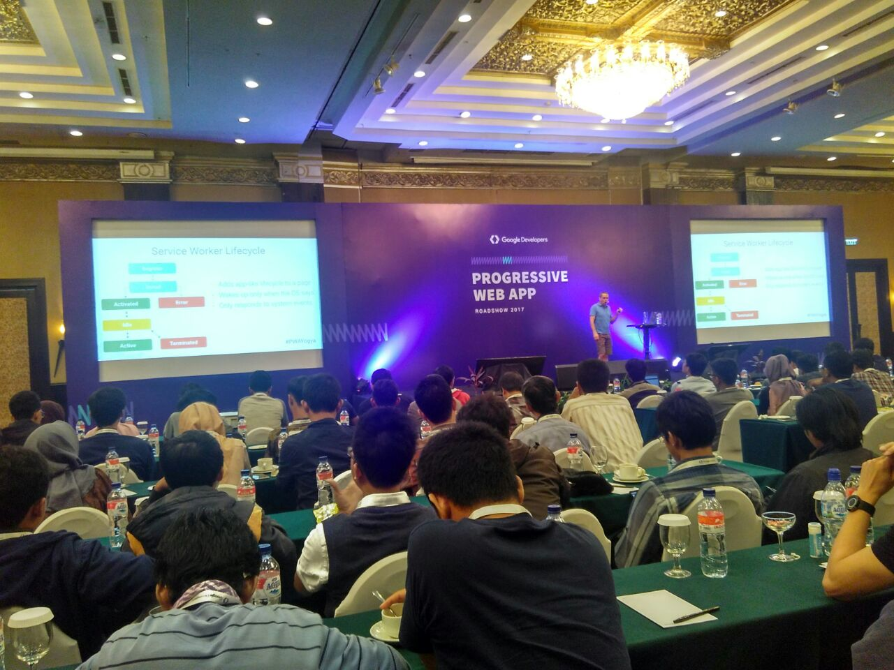
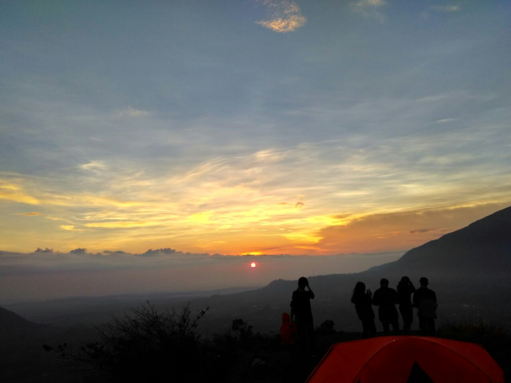

Saya baru sadar, ternyata tahun lalu saya tidak pernah menulis di blog ini. Saya merasa 2017 adalah tahun yang sibuk dan banyak hal-hal baru yang saya temukan. Meskipun begitu, saya juga merasa banyak melakukan hal yang nirmanfaat dan buang-buang waktu. Puncaknya, beberapa hari di awal tahun ini, saya sempat _down_ karena terlalu memikirkan apa yang sudah saya lakukan, seberapa besar impact yang sudah saya berikan, dan bagaimana saya bisa bermanfaat dalam hidup ini.

Dan setelah saya ngobrol dengan salah seorang teman, dia menyarankan untuk membuat _goal list_ dan plan jangka pendek agar target hidup lebih terukur. Setelah itu saya putuskan untuk coba pakai Trello untuk masalah ini. Dan sebagai refleksi, saya akan coba merangkum apa saja yang telah saya lakukan selama setahun yang lalu. Sambil mengingat-ingat hal menarik yang terjadi tiap bulannya.

### Januari

Membuka tahun dengan membaca "Catatan Seorang Demonstran" karya Soe Hok Gie. Saya sudah agak lama tahu sekilas tentang dia, dan baru kali ini sempat membacanya berhubung ada bukunya di Djeladjah.

Gunung pertama di tahun ini adalah Merbabu. Kami naik ber-empat lewat jalur Selo. Hujan menjadi teman setia dalam perjalanan kami waktu itu. Hingga ban bocor di jalan antara Ketep-Selo, yang beruntungnya kami ada tambal ban dekat lokasi. Saya tidak bisa membayangkan kalau ban kami bocor ketika jauh dari desa.

Sepulangnya, dua dari kami memutuskan untuk pulang sore itu juga. Sedang kami berdua memutuskan untuk pulang besok pagi karena gerimis, berkabut, dan menjelang malam, dimana penglihatan saya berkurang saat malam hari. Belum lagi jalan Selo-Ketep yang lubangnya jauh lebih besar dari bakpao-nya Pak Setnov. Dan paginya, saya bersyukur karena mendapat tilang di daerah Bogem, setelah sempat melarikan diri tapi sedikit bodoh. :)

### Februari

Saya sangat _excited_ karena akan disidang untuk pelanggaran saya bulan lalu. Tapi ke-_excited_-an saya langsung hilang setelah tahu di pengadilan hanya melihat daftar pelanggar dan denda yang harus dibayar. Padahal ekspektasi saya bakal mengikuti proses sidang layaknya terpidana kasus-kasus pidana, haha.

### Maret

Maret tidak banyak kegiatan yang saya ingat. Salah satunya AMCC mengadakan _techtalk_ #1 dengan speaker Mas Gama. Beliau alumni sekampus dan waktu itu bekerja sebagai Lead Developer di Qlue. Kalau tidak salah, beliau _share_ tentang  realita dunia kerja di bidang teknologi dan _carrer path_-nya.

### April

Di bulan April, saya memulai sebuah blog yang berisi catatan sehari-hari. Saya coba untuk konsisten menulis tiap hari. Tapi pada kenyataannya, konsistensi saya melemah. Dari tiap hari, menjadi per 2 hari, lalu per minggu. Dan sampai saat ini sangat jarang saya perbarui. :(

Saya memutuskan untuk mengikutsertakan proyek sampingan saya, app SadarKawasan, di Amicta. Tanggal 26, saya resmi bergabung dengan [Gifood](https://gifood.id). Kata foundernya, Gifood ini adalah platform yang menghubungkan orang-orang yang memiliki makanan berlebih dengan orang yang lebih membutuhkan. Di sini saya berkontribusi dalam hal teknis dan aplikasi yang akan dibuat.

Akhir bulan, saya merealisasikan rencana Opsih Gunung Andong dengan beberapa kawan dari Glacial. Hasilnya, kami berhasil membawa 6 kantong _trashbag_ penuh sampah dari puncak Andong. Kami juga memasang banner yang isinya ajakan untuk membawa turun sampah masing-masing. Semoga semangat baik seperti ini bisa kita lakukan lagi, yak! :)

### Mei

Awal Mei saya menonton kelanjutan dari film _Guardians of The Galaxy_. Ceritanya lumayan menarik dan menurut saya, level cerita GOTG vol. 2 ini jauh di atas The Avenger atau Captain America. Di film ini, bumi hanyalah bagian kecil dari alam semesta. Levelnya sudah *multi-universe*. Dari ayah Peter Quill yang menemukannya setelah jutaan tahun (katanya), sampai diketahui kalau ia punya _the power of creation_, kekuatan penciptaan. Yang bahkan setahu saya Odin saja tidak punya kekuatan seperti itu.

Bulan ini juga saya mendaftarkan domain [sadarkawasan.org](https://sadarkawasan.org) yang ternyata masuk nominasi di Amicta. _Thanks to Firebase_, haha. Yah, walaupun tidak menang. Karena yang menang semuanya punya _revenue plan. S_edang saya tidak memikirkannya sama sekali karena tujuan awal saya membuatnya adalah murni untuk non-profit.

Saat itu juga saya belajar jadi MC untuk salah satu event di AMCC. Saya sering ikut acara techtalk, jadi sekalian saja saya praktikkan dan ternyata masih banyak groginya, haha. Selain MC, ada juga kesempatan untuk jadi juri di event BEM, yang menambah pengalaman saya.

### Juni

UAS terakhir sebelum akhirnya hanya akan menghabiskan waktu dengan urusan skripsi. Mulai tidak konsisten dengan blog yang dimulai April lalu.

### Juli

Di bulan ini, Saya berkesempatan mengikuti 2 _event startup_, yaitu Jogja Startup Day Bekup. Mewakili Gifood dengan 2 orang lainnya. Dari event-event ini, saya belajar banyak tentang dunia persilatan per-_startup_-an dan kenal dengan orang-orang baru sesama penggerak _startup_ di Jogja.

Seperti tahun-tahun sebelumnya, saya ikut acara tahunan Glacial, Pemantapan anggota muda sebelum jadi anggota pengurus. Tahun ini acara dilaksanakan di daerah Thekelan, Kopeng, di kaki Gunung Merbabu. Acara-acara seperti ini menjadi salah satu cara untuk saling bertemu kembali antar alumni.

Selain itu adalah ekspedisi Arjuno-Welirang selama 5 hari yang sangat menenangkan. Ini adalah perjalanan jauh pertama yang hanya berdua. Kami jadi lebih mengenal satu dengan lainnya, selain bertemu dengan banyak teman baru di sepanjang jalur.

Gifood menjadi juara 2 DiLo Fest 2017, hore!

### Agustus

Saya bikin SIM baru. Saya memutuskan untuk tidak memperpanjang SIM lama karena beberapa alasan. Salah satunya adalah SIM lama yang saya peroleh lewat jalur belakang. Ternyata bikin SIM gampang-gampang susah. Mulai dari prosedur yang sebenarnya sederhana, tapi banyak formalitasnya. Biaya yang murah dan transparan. Hingga saya yang harus datang sampai 4 kali untuk tes berkendara karena gagal, haha. Banyak juga yang bilang tesnya sulit, tidak sedikit juga yang bilang dipersulit. Padahal menurut saya tesnya sudah objektif, sesuai SOP. Kitanya aja yang terlalu terbiasa dengan yang mudah-mudah. Hal yang paling menjengkelkan adalah saya harus balik 3 bulan lagi karena blangko SIM habis. 😒

Kesempatan baik bulan ini adalah menjadi ketua panitia LDKMO di AMCC dan mengikuti acara Line Creativate terus dapat boneka Brown. :D

Progressive Web Apps Roadshow, Jogja

### September

Seperti tahun-tahun sebelumnya, saya diminta bantuan untuk ngurusin Pemilihan ketua OSIS di SMA saya dulu. Memang sejak saya bikin sistemnya di tahun 2014 sampai sekarang, alhamdulillah masih dipakai terus tiap tahun. Yang saya sayangkan, tidak banyak yang mengikuti jejak nakal saya. :(

Saya juga bersekempatan untuk jadi moderator pertama kali di acara AMCC dengan KOMA. Asik juga rasanya jadi moderator. Dan untungnya bukan acara formal yang biasanya banyak aturan ini-itu.

Dan akhirnya akhir bulan ini saya lengser dari kepengurusan AMCC 2016-2017. Senang karena akhirnya akan lebih banyak waktu untuk _explore_ hal lain. Sedih karena sebenarnya masih banyak ide-ide yang ingin diimplementasikan di AMCC.

Sunrise di puncak Gn. Andong

### Oktober

Bulan ini sangat aktif berkegiatan. Naik gunung 2 kali, Andong dan Merbabu. Ikut acaranya PHP Jogloraya dan Facebook Dev Circle Jogja. Keduanya untuk pertama kali buat saya. Senangnya jadi punya banyak relasi, dan tentu saja _cemilan_. :p

Alhamdulillah juga app SadarKawasan menang di kompetisi [DBS Developer Challenge](https://www.dicoding.com/challenges/232). Lumayan dapat point di Dicoding, bisa ditabung buat ditukar reward macem-macem, haha.

### November

Saya mulai mencoba serius di Upwork. Dan setelah beberapa hari, saya dapat client pertama. Sekarang jadi tahu bagaimana sistem di Upwork bekerja dan bagaimana saya harus bekerja sebagai freelancer yang baik.

Karena pajak motor saya habis bulan ini, saya coba memperpanjang STNK sendiri yang ternyata gampang sekali. Mungkin orang-orang sekarang sudah kaya-kaya karena lebih suka memakai jasa calo. Eh, mungkin niat mereka untuk berbagi ke sesama ya. 😏

Saya juga bersempatan menjadi relawan di Gunung Kidul yang waktu itu terkena musibah banjir dan tanah longsor di beberapa lokasi sekaligus. Saya diterjunkan di daerah Nglipar dengan kondisi saat banjir setinggi leher orang dewasa. :(

### Desember

Alhamdulillah, Gifood berhasil lolos Bekup ke X besar (saya tidak tahu, haha) di acara Bekup lalu dan dapat kesempatan ikut mentoring. Ada 3 _tracks_, _business_, _creative_, dan _technical_. Saya ambil yang _technical_ karena memang basic saya disitu. Lagi-lagi dapat banyak relasi dan ilmu baru, termasuk SCRUM yang lagi ngetren.

Alhamdulillah lagi, app SadarKawasan menang lagi di challenge [Indosat Ooredoo Wireless Innovation Contest 11](https://www.dicoding.com/challenges/312). Pointnya masih jauuh banget untuk dapat Macbook, haha.

Dan saya selalu suka akhir tahun karena Glacial punya proker wajib Pendidikan Dasar. Offline menjadi sebuah kebutuhan buat saya, dan acara-acara Glacial selalu menjadi lampiasan kebutuhan luring saya, di alam terbuka.

---

Ternyata panjang juga jadinya, hmm. Kalau dipikir-pikir, Tuhan baik sekali pada Saya setahun lalu. Terkadang saya merasa kurang bersyukur ketika _down_. Tapi juga berpikir saya kurang melakukan sesuatu untuk merealisasikan syukur tersebut.

Semoga tahun ini kita bisa menjadi orang yang lebih baik dan berguna, _aamiin_.
